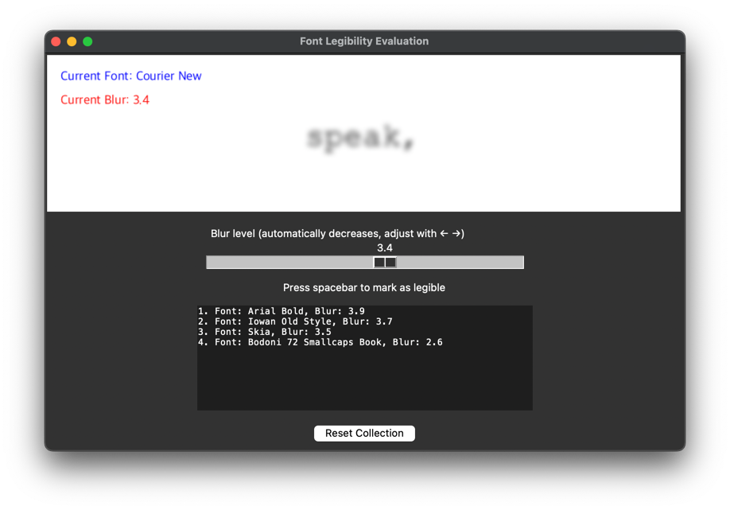

# Font Legibility Benchmarking

## Project Description

**Font Legibility Benchmarking** is a Python project designed to evaluate and compare the legibility of different fonts by analyzing their appearance under varying levels of blur.

It's also a game.

Perhaps mostly a game.



## Features

- Rapidly throws decreasibly blurred words at you. When you think you are able to read the words comfortably, hit spacebar to save the font name and blur level in your session's ranking.
- Finds fonts in your system's font directory and loads them for testing.

## Installation

To install the dependencies, ensure you have [Poetry](https://python-poetry.org/) installed. Then run:

```sh
poetry install
```

## Usage

To start the application, run:

```sh
python main.py
```

The main interface will load, allowing you to begin testing fonts by playing the legibility game immediately.
